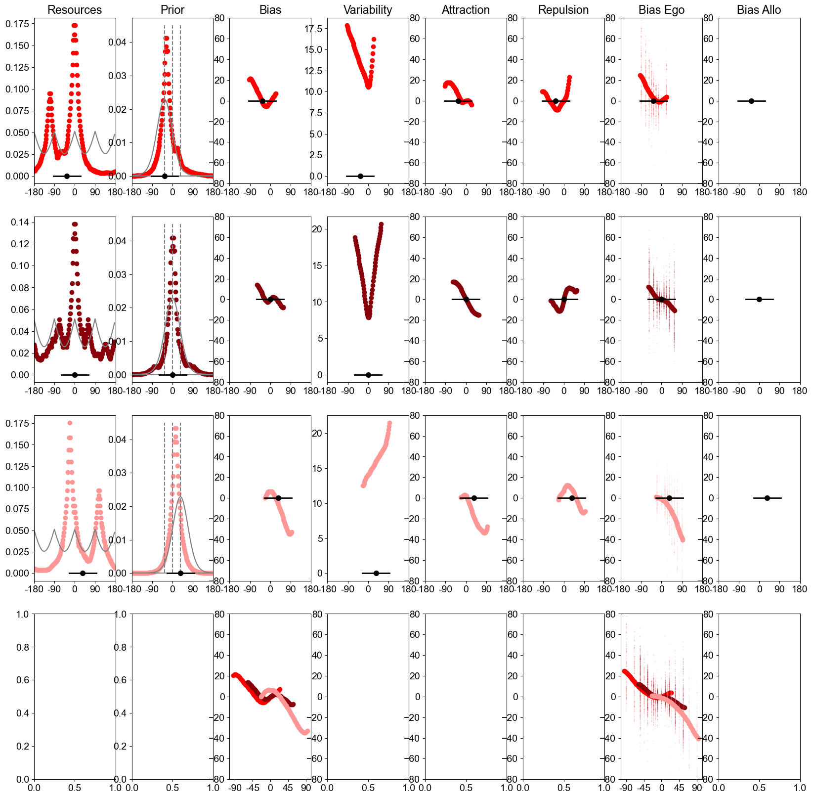
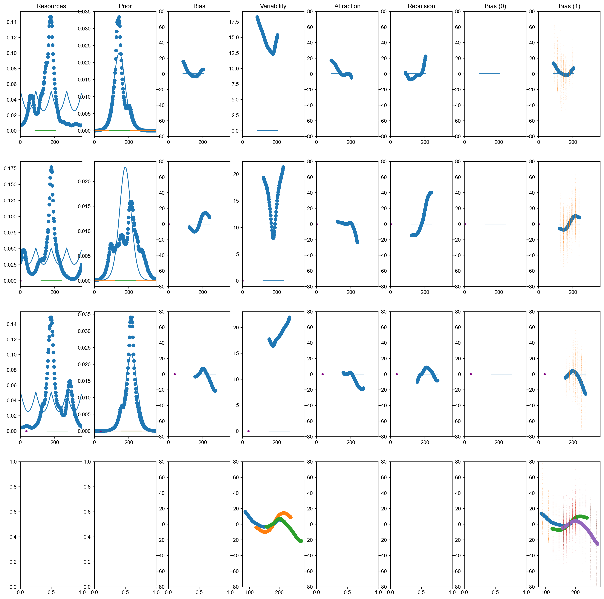

# Heading Biases

## Fit on Egocentric Condition

This is a direct fit, with no transformation.

Command:

    python3 RunReisenegger_FreePrior_DifFreeResources_byCentralOrientation_Simplified_Shift_Co0_Prior_SepEnc_Debug.py 2 0 10.0 180 50

Fit: 

PDF link: [here](figures/RunReisenegger_FreePrior_DifFreeResources_byCentralOrientation_Simplified_Shift_Co0_Prior_SepEnc_Debug.py_2_0_10.0_180_50.pdf)

Goodness of fit: [losses/RunReisenegger_FreePrior_DifFreeResources_byCentralOrientation_Simplified_Shift_Co0_Prior_SepEnc_Debug.py_2_0_10.0_180.txt](file)

## Fit on Allocentric Condition

### Direct fit, no transformation

Command:

    python3 RunReisenegger_FreePrior_DifFreeResources_byCentralOrientation_Simplified_Shift_Co1_Prior_SepEnc_Debug.py 2 0 10.0 180 50
  
Fit: 

PDF link: [here](figures/RunReisenegger_FreePrior_DifFreeResources_byCentralOrientation_Simplified_Shift_Co1_Prior_SepEnc_Debug.py_2_0_10.0_180_50.pdf)

Goodness of fit: [losses/RunReisenegger_FreePrior_DifFreeResources_byCentralOrientation_Simplified_Shift_Co1_Prior_SepEnc_Debug.py_2_0_10.0_180.txt](file)

### Transformation after decoding

Freeze encoding and prior based on the egocentric condition

Here, there are two rounds of Bayesian decoding.

Command:

    python3 RunReisenegger_Transformation8_1.py 2 0 1.0 180 50

Fit: [figures/RunReisenegger_Transformation8_1.py_2_0_1.0_180_50.pdf](plot)

Goodness of fit: [losses/RunReisenegger_Transformation8_1.py_2_0_1.0_180.txt](file)

### Transformation without decoding

Freeze encoding and prior based on the egocentric condition

Command:

    python3 RunReisenegger_Transformation8_1_OnlyOneDecoding.py 2 0 1.0 180 50

Fit: [figures/RunReisenegger_Transformation8_1_OnlyOneDecoding.py_2_0_1.0_180_50.pdf](plot)

Goodness of fit: [losses/RunReisenegger_Transformation8_1_OnlyOneDecoding.py_2_0_1.0_180.txt](file)

