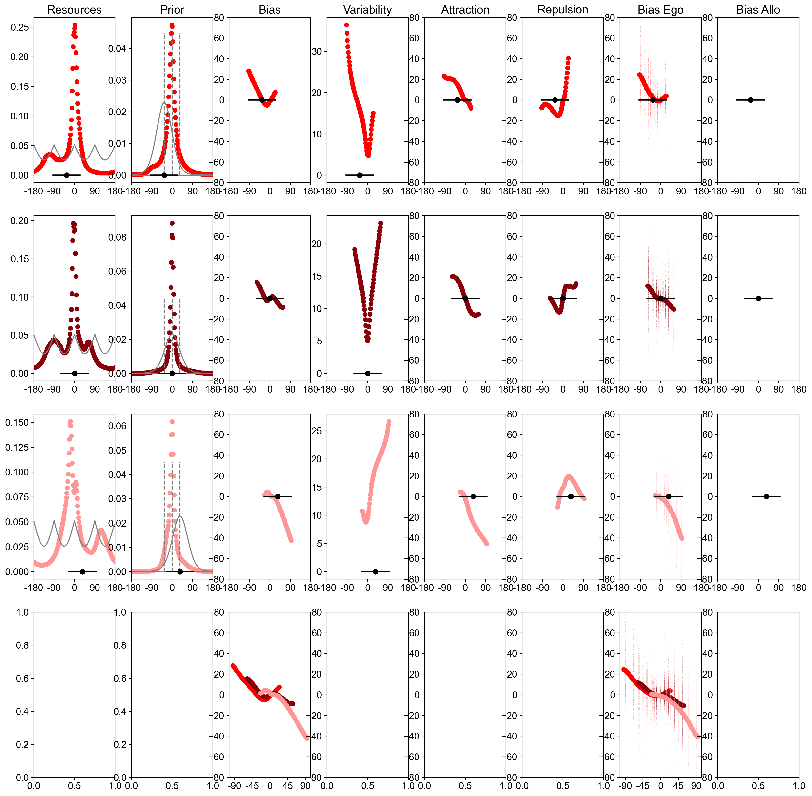
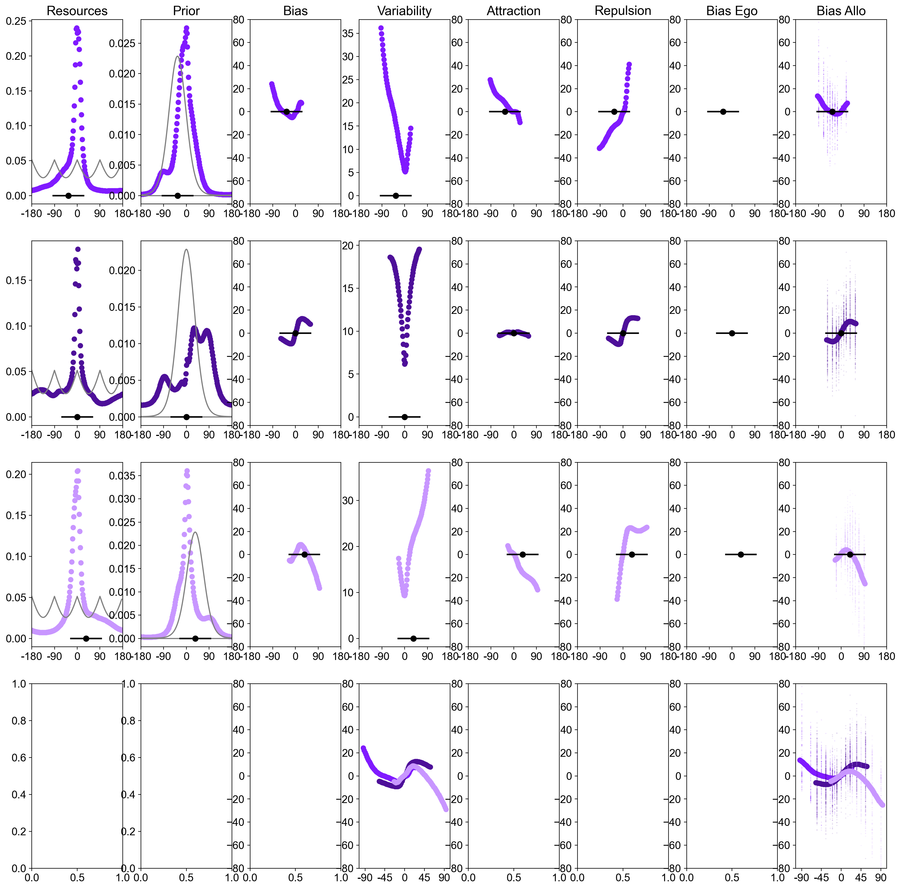
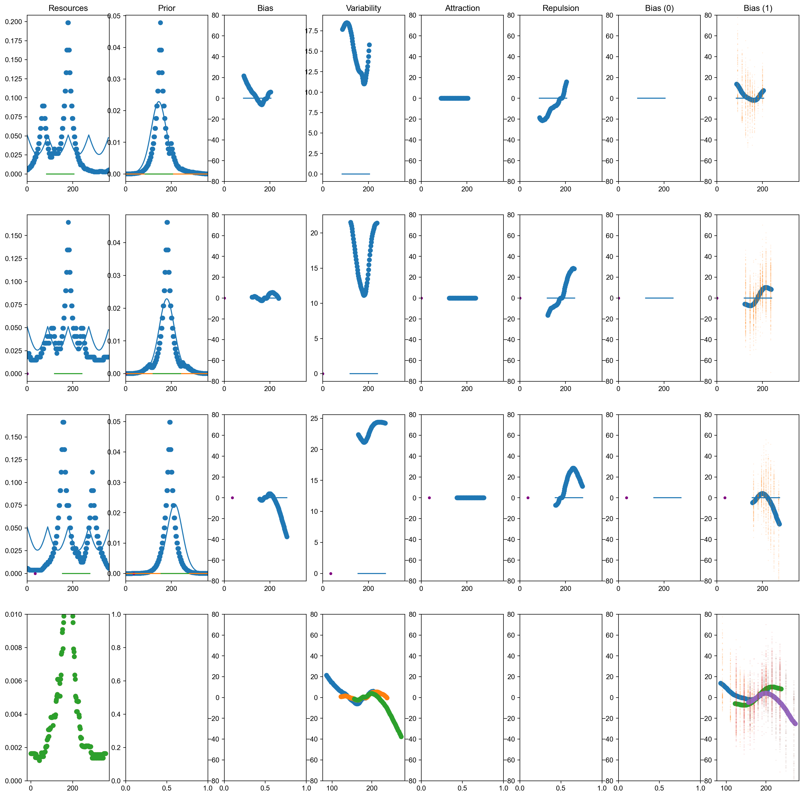
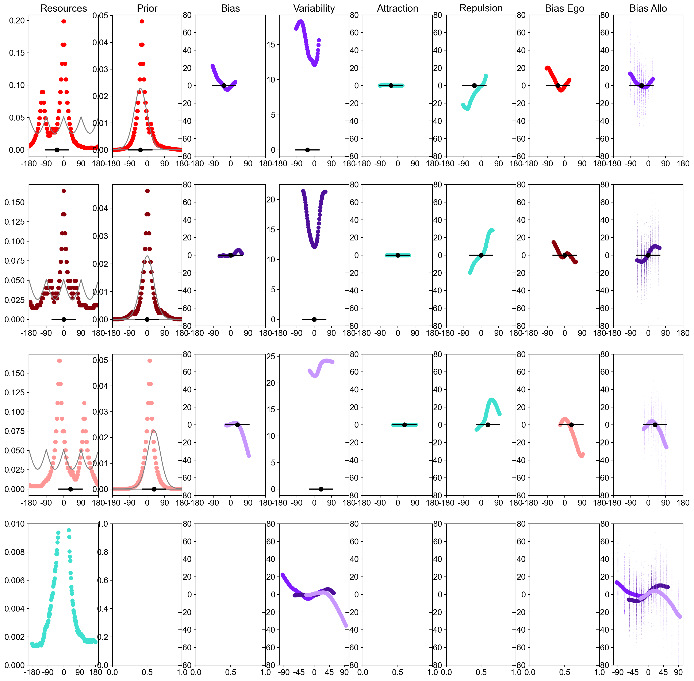
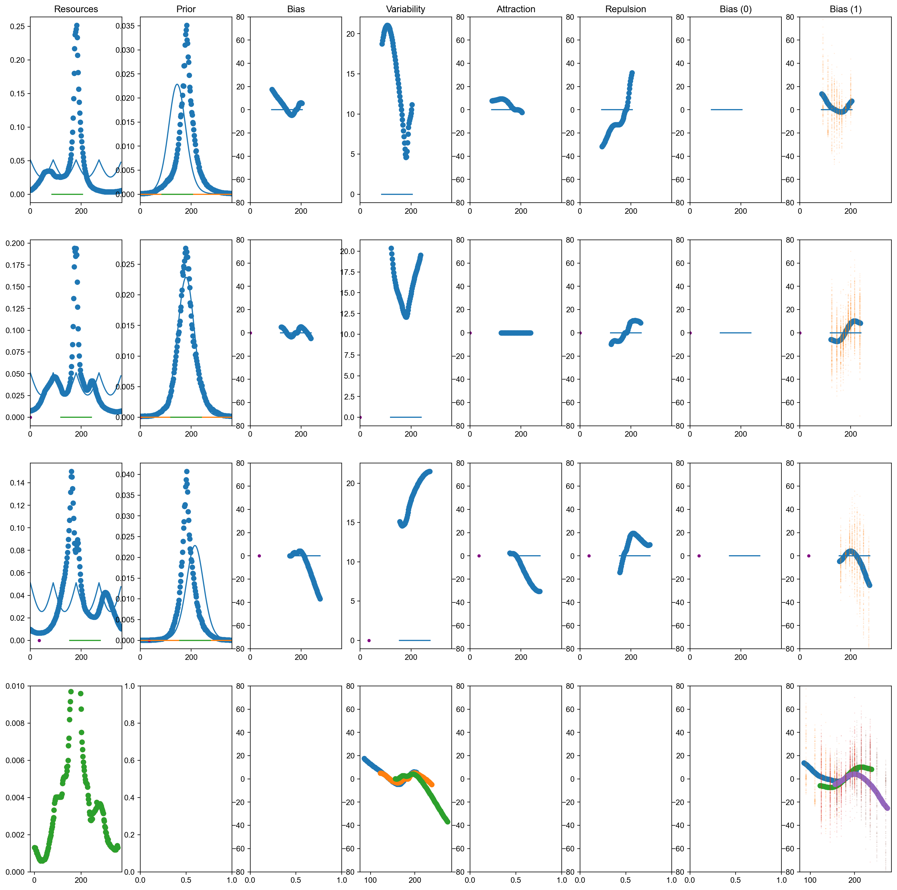
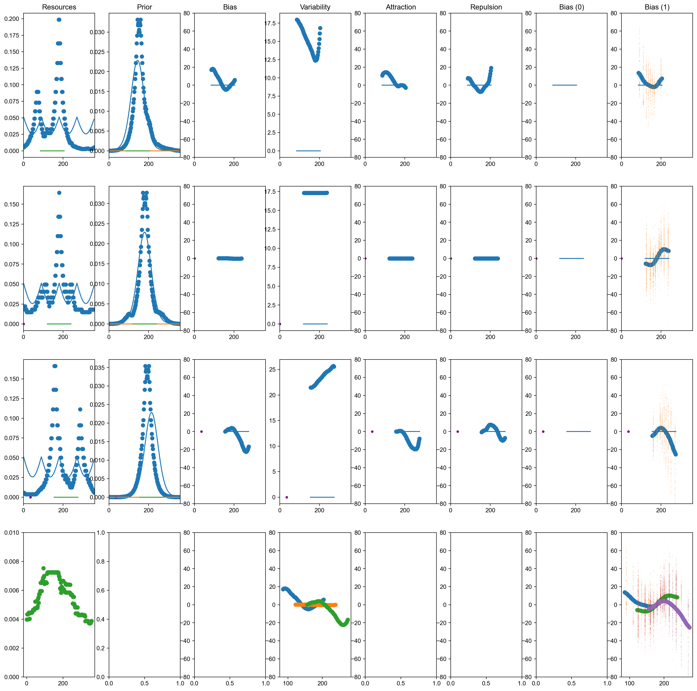
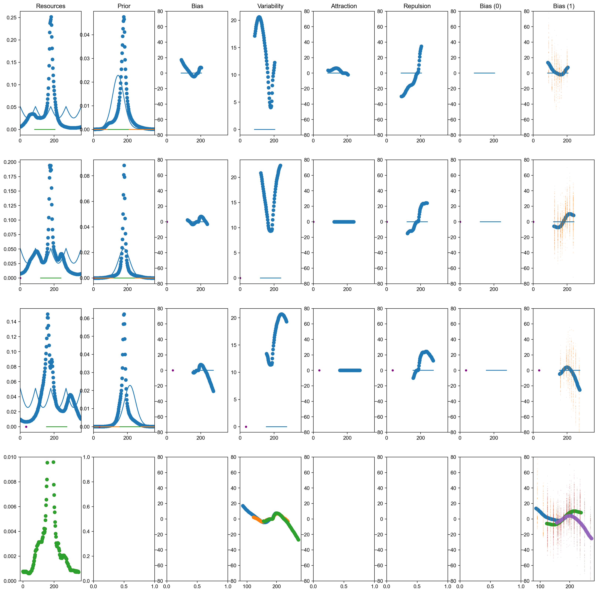
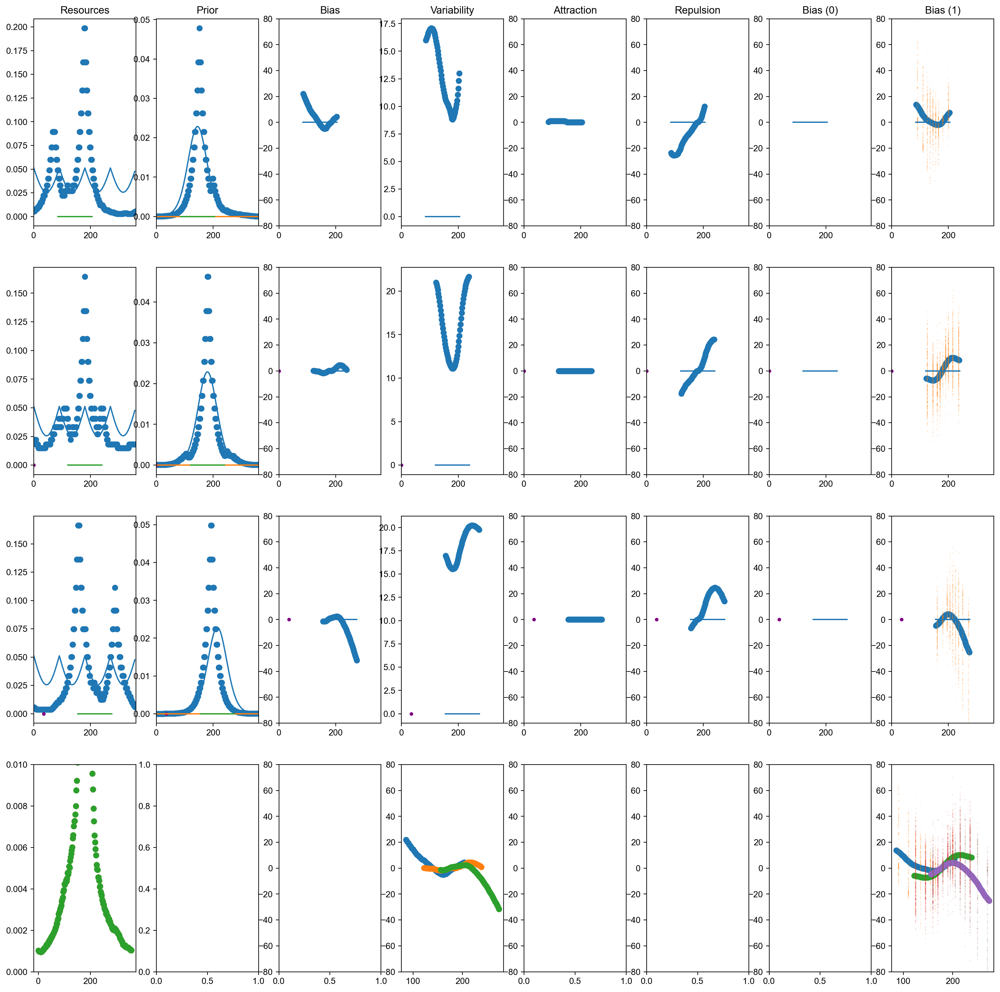

# Heading Biases

## Fit on Egocentric Condition

This is a direct fit, with no transformation.

Command:

    python3 RunReisenegger_FreePrior_DifFreeResources_byCentralOrientation_Simplified_Shift_Co0_Prior_SepEnc_Debug.py 2 0 1.0 180 50

Fit (REG_WEIGHT = 1.0): 

Fit (REG_WEIGHT = 10.0): 

PDF link: [here](figures/RunReisenegger_FreePrior_DifFreeResources_byCentralOrientation_Simplified_Shift_Co0_Prior_SepEnc_Debug.py_2_0_1.0_180_50.pdf)

Goodness of fit: [see here](losses/RunReisenegger_FreePrior_DifFreeResources_byCentralOrientation_Simplified_Shift_Co0_Prior_SepEnc_Debug.py_2_0_1.0_180.txt)

All fitted parameters: [see here](logs/CROSSVALID/RunReisenegger_FreePrior_DifFreeResources_byCentralOrientation_Simplified_Shift_Co0_Prior_SepEnc_Debug.py_2_0_1.0_180.txt)

#### Fit across exponents

Command:

    python3 RunReisenegger_FreePrior_DifFreeResources_byCentralOrientation_Simplified_Shift_Co0_Prior_SepEnc_Debug_L0.py 0 0 1.0 180 50
    python3 RunReisenegger_FreePrior_DifFreeResources_byCentralOrientation_Simplified_Shift_Co0_Prior_SepEnc_Debug_L1.py 1 0 1.0 180 50
    for i in 4 6 8 ; do python3 RunReisenegger_FreePrior_DifFreeResources_byCentralOrientation_Simplified_Shift_Co0_Prior_SepEnc_Debug.py $i 0 1.0 180 50 ; done

Resulting goodness of fit: TODO plot PNG

## Fit on Allocentric Condition

### Direct fit, no transformation

Command:

    python3 RunReisenegger_FreePrior_DifFreeResources_byCentralOrientation_Simplified_Shift_Co1_Prior_SepEnc_Debug.py 2 0 1.0 180 50
  
Fit (REG_WEIGHT=1.0): 

Fit (REG_WEIGHT=10.0): 

PDF link: [here](figures/RunReisenegger_FreePrior_DifFreeResources_byCentralOrientation_Simplified_Shift_Co1_Prior_SepEnc_Debug.py_2_0_1.0_180_50.pdf)

Goodness of fit: [see here](losses/RunReisenegger_FreePrior_DifFreeResources_byCentralOrientation_Simplified_Shift_Co1_Prior_SepEnc_Debug.py_2_0_1.0_180.txt)

All fitted parameters: [see here](logs/CROSSVALID/RunReisenegger_FreePrior_DifFreeResources_byCentralOrientation_Simplified_Shift_Co1_Prior_SepEnc_Debug.py_2_0_1.0_180.txt)

#### Fit across exponents

TODO

### Transformation after decoding

Freeze encoding and prior based on the egocentric condition

Here, there are two rounds of Bayesian decoding.

Command:

    python3 RunReisenegger_Transformation8_1.py 2 0 1.0 180 50

Fit (REG_WEIGHT=1.0): 

Fit (REG_WEIGHT=10.0): 

PDF link: [here](figures/RunReisenegger_Transformation8_1.py_2_0_1.0_180_50.pdf)

Goodness of fit: [see here](losses/RunReisenegger_Transformation8_1.py_2_0_1.0_180.txt)

All fitted parameters: [see here](logs/CROSSVALID/RunReisenegger_Transformation8_1.py_2_0_1.0_180.txt)

The goodness of fit is much stronger than when we do direct fitting. The difference in fact is strikingly large. We need to sanity-check that this is real and not some kind of artifact.

#### Fit across exponents

Commands:

    python3 RunReisenegger_Transformation8_1_L0-L0.py 0-0 0 1.0 180 50
    python3 RunReisenegger_Transformation8_1_L0-L0.py 0-0 0 10.0 180 50
    python3 RunReisenegger_Transformation8_1_L1.py 1 0 1.0 180 50
    python3 RunReisenegger_Transformation8_1_L1.py 1 0 10.0 180 50
    for i in 4 6 8 ; do python3 RunReisenegger_Transformation8_1.py $i 0 1.0 180 50 ; done
    for i in 4 6 8 ; do python3 RunReisenegger_Transformation8_1.py $i 0 10.0 180 50 ; done

### Transformation without decoding

Freeze encoding and prior based on the egocentric condition

This is close to the model from Remington et al's work.

Command:

    python3 RunReisenegger_Transformation8_1_OnlyOneDecoding.py 2 0 1.0 180 50

Fit (REG_WEIGHT=1.0): 

Fit (REG_WEIGHT=10.0): 

PDF link: [here](figures/RunReisenegger_Transformation8_1_OnlyOneDecoding.py_2_0_1.0_180_50.pdf)

Goodness of fit: [see here](losses/RunReisenegger_Transformation8_1_OnlyOneDecoding.py_2_0_1.0_180.txt)

Performance seems slightly worse than the previous version.

All fitted parameters: [see here](logs/CROSSVALID/RunReisenegger_Transformation8_1_OnlyOneDecoding.py_2_0_1.0_180.txt)

#### Fit across exponents

TODO

### Transformation without decoding (second version)

Freeze encoding and prior based on the egocentric condition

This is close to the model from Remington et al's work.

Command:

    python3 RunReisenegger_Transformation8_1_OnlyOneDecoding_2.py 2 0 1.0 180 50

Fit (REG_WEIGHT=1.0): 

Fit (REG_WEIGHT=10.0): 

PDF link: [here](figures/RunReisenegger_Transformation8_1_OnlyOneDecoding_2.py_2_0_1.0_180_50.pdf)

Goodness of fit: [see here](losses/RunReisenegger_Transformation8_1_OnlyOneDecoding_2.py_2_0_1.0_180.txt)

Performance seems slightly worse than the previous version.

All fitted parameters: [see here](logs/CROSSVALID/RunReisenegger_Transformation8_1_OnlyOneDecoding_2.py_2_0_1.0_180.txt)

#### Fit across exponents

TODO

