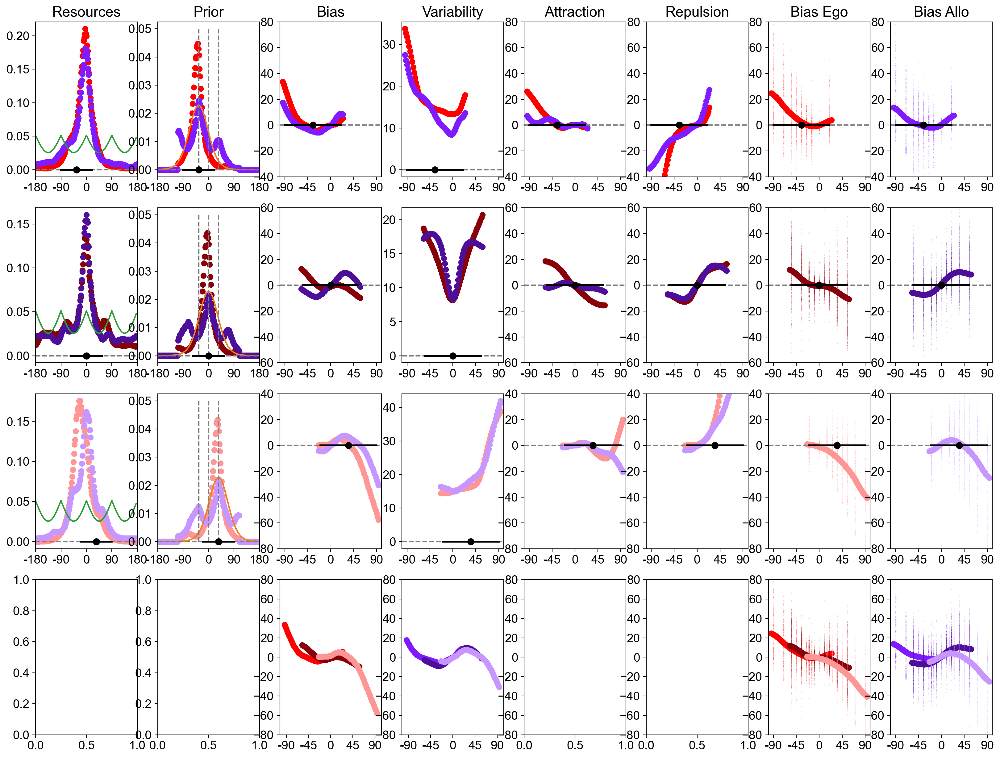
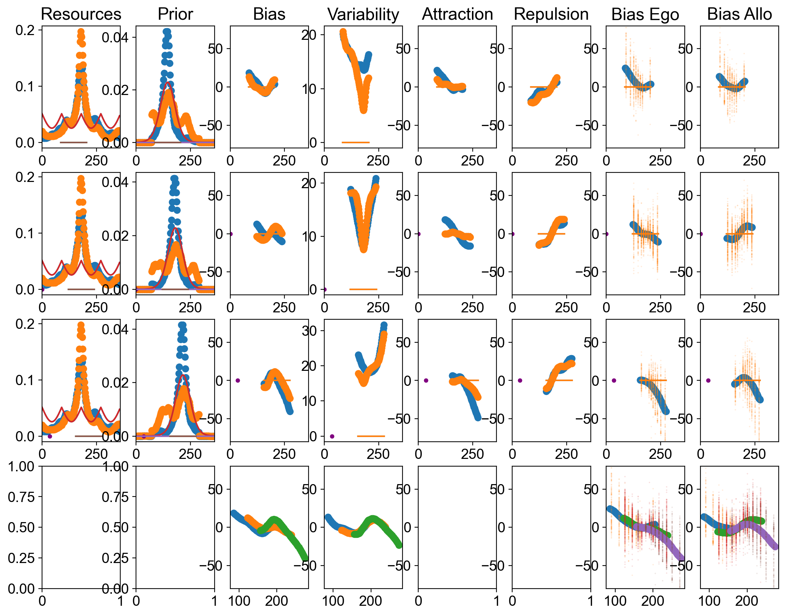
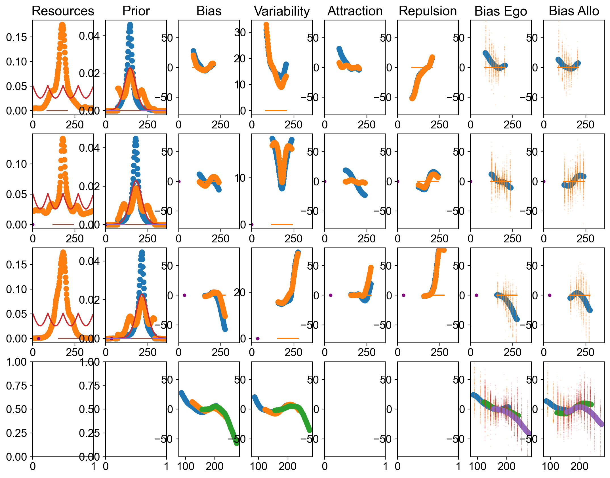
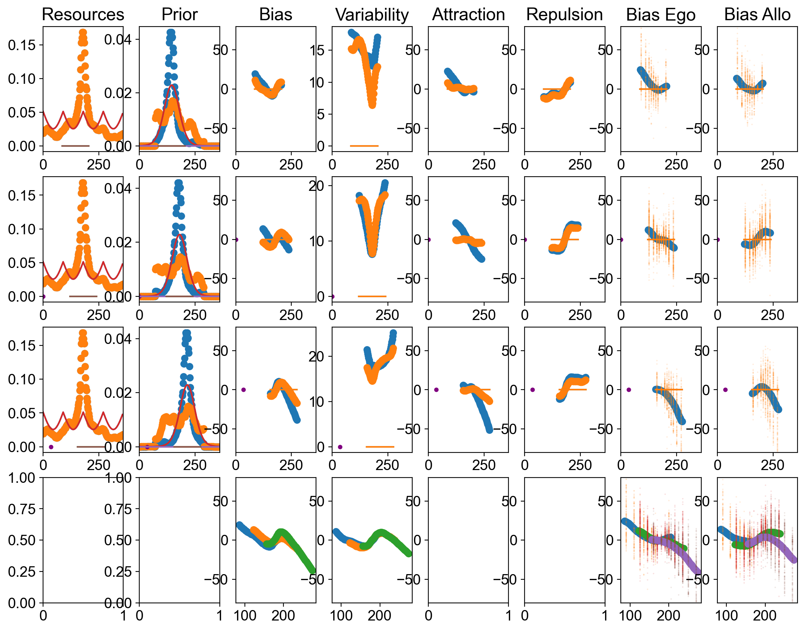
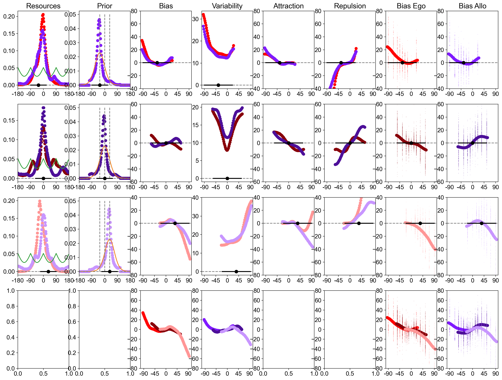

# Heading Biases

Repo for the computational model of "Reference frames reverse biases in human heading perception" (about to be submitted)

Code based on Hahn & Wei (2024). A unifying theory explains seemingly contradictory biases in perceptual estimation. *Nature Neuroscience*.

Here are the results of the 4 different models with different constraints:

## Fit with prior invariance across ranges (but rotated according to the central heading)

This constraint proved to be the most important one to achieve biologically plausible results.

Command:

    python3 RunReisenegger_FreePrior_DifFreeResources_byCentralOrientation_Simplified_Shift_Co01_Prior_SepEnc_Debug_Edge_ShiftPrior.py 2 0 10.0 180 50

Fit (REG_WEIGHT = 10.0): 

PDF link: [here](figures/RunReisenegger_FreePrior_DifFreeResources_byCentralOrientation_Simplified_Shift_Co01_Prior_SepEnc_Debug_Edge_ShiftPrior.py_2_0_10.0_180_50.pdf)

Goodness of fit: [see here](losses/RunReisenegger_FreePrior_DifFreeResources_byCentralOrientation_Simplified_Shift_Co01_Prior_SepEnc_Debug_Edge_ShiftPrior.py_2_0_10.0_180.txt)

All fitted parameters: [see here](logs/CROSSVALID/RunReisenegger_FreePrior_DifFreeResources_byCentralOrientation_Simplified_Shift_Co01_Prior_SepEnc_Debug_Edge_ShiftPrior.py_2_0_10.0_180.txt)

## Fit with prior invariance across ranges (with rotation) and resources invariance across ranges

This fit is a bit worse (higher NLL) than the previous one.

Command:

    python3 RunReisenegger_FreePrior_DifFreeResources_byCentralOrientation_Simplified_Shift_Co01_Prior_SepEnc_Debug_Edge_ShiftPrior_SameEncPerCO.py 2 0 10.0 180 50
  
Fit (REG_WEIGHT=10.0): 

PDF link: [here](figures/RunReisenegger_FreePrior_DifFreeResources_byCentralOrientation_Simplified_Shift_Co01_Prior_SepEnc_Debug_Edge_ShiftPrior_SameEncPerCO.py_2_0_10.0_180_50.pdf)

Goodness of fit: [see here](losses/RunReisenegger_FreePrior_DifFreeResources_byCentralOrientation_Simplified_Shift_Co01_Prior_SepEnc_Debug_Edge_ShiftPrior_SameEncPerCO.py_2_0_10.0_180.txt)

All fitted parameters: [see here](logs/CROSSVALID/RunReisenegger_FreePrior_DifFreeResources_byCentralOrientation_Simplified_Shift_Co01_Prior_SepEnc_Debug_Edge_ShiftPrior_SameEncPerCO.py_2_0_10.0_180.txt)

## Fit with prior invariance across ranges and resources invariance across conditions

This fit is a bit worse than the one we just had.

Command:

    python3 RunReisenegger_FreePrior_DifFreeResources_byCentralOrientation_Simplified_Shift_Co01_Prior_SepEnc_Debug_Edge_ShiftPrior_SameEncPerCond.py 2 0 10.0 180 50

Fit (REG_WEIGHT=10.0): 

PDF link: [here](figures/RunReisenegger_FreePrior_DifFreeResources_byCentralOrientation_Simplified_Shift_Co01_Prior_SepEnc_Debug_Edge_ShiftPrior_SameEncPerCond.py_2_0_10.0_180_50.pdf)

Goodness of fit: [see here](losses/RunReisenegger_FreePrior_DifFreeResources_byCentralOrientation_Simplified_Shift_Co01_Prior_SepEnc_Debug_Edge_ShiftPrior_SameEncPerCond.py_2_0_10.0_180.txt)

All fitted parameters: [see here](logs/CROSSVALID/RunReisenegger_FreePrior_DifFreeResources_byCentralOrientation_Simplified_Shift_Co01_Prior_SepEnc_Debug_Edge_ShiftPrior_SameEncPerCond.py_2_0_10.0_180.txt)

## Fit with prior invariance across ranges and resources invariance across ranges and conditions

Interestingly, adding both contraints for the resources results in the best fit we found. Presumably because it reduces overfitting.

Command:

    python3 RunReisenegger_FreePrior_DifFreeResources_byCentralOrientation_Simplified_Shift_Co01_Prior_SepEnc_Debug_Edge_ShiftPrior_SameEncPerCO_SameEncPerCond.py 2 0 10.0 180 50

Fit (REG_WEIGHT=10.0): 

PDF link: [here](figures/RunReisenegger_FreePrior_DifFreeResources_byCentralOrientation_Simplified_Shift_Co01_Prior_SepEnc_Debug_Edge_ShiftPrior_SameEncPerCO_SameEncPerCond.py_2_0_10.0_180_50.pdf)

Goodness of fit: [see here](losses/RunReisenegger_FreePrior_DifFreeResources_byCentralOrientation_Simplified_Shift_Co01_Prior_SepEnc_Debug_Edge_ShiftPrior_SameEncPerCO_SameEncPerCond.py_2_0_10.0_180.txt)

All fitted parameters: [see here](logs/CROSSVALID/RunReisenegger_FreePrior_DifFreeResources_byCentralOrientation_Simplified_Shift_Co01_Prior_SepEnc_Debug_Edge_ShiftPrior_SameEncPerCO_SameEncPerCond.py_2_0_10.0_180.txt)

## Fit with prior invariance across ranges and conditions

This second constraint on the prior dramatically hurts the fit.

Commands:

    python3 RunReisenegger_FreePrior_DifFreeResources_byCentralOrientation_Simplified_Shift_Co01_Prior_SepEnc_Debug_Edge_ShiftPrior_SamePriPerCond.py 2 0 10.0 180 50

Fit (REG_WEIGHT=10.0): 

PDF link: [here](figures/RunReisenegger_FreePrior_DifFreeResources_byCentralOrientation_Simplified_Shift_Co01_Prior_SepEnc_Debug_Edge_ShiftPrior_SamePriPerCond.py_2_0_10.0_180_50.pdf)

Goodness of fit: [see here](losses/RunReisenegger_FreePrior_DifFreeResources_byCentralOrientation_Simplified_Shift_Co01_Prior_SepEnc_Debug_Edge_ShiftPrior_SamePriPerCond.py_2_0_10.0_180.txt)

All fitted parameters: [see here](logs/CROSSVALID/RunReisenegger_FreePrior_DifFreeResources_byCentralOrientation_Simplified_Shift_Co01_Prior_SepEnc_Debug_Edge_ShiftPrior_SamePriPerCond.py_2_0_10.0_180.txt)

